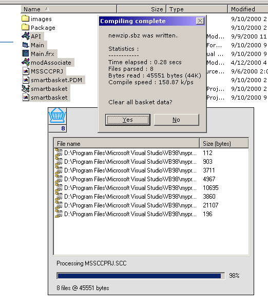



## A Winzip style app \(no comp\.\)

### Description

Similar to Winzip (without the compression tho) it complies many files into one file. double clicking on the basket icon (check screenshot) minimises and maximises the App (which is always on top) - You drag files to the basket or listview and it adds them to the list. You can then compile the list...A nice bonus, is that you can drag files from anywhere in explorer, add them to the list, and then drag them out of the list to copy it elsewhere.

Please remember that this is a very early version of what this app will be able to do. I'm already half-way through a compression algorithm - and when i'm finished that, and other features, i'll submit - ver. 2.

It also has some basic file association attached, to open the files with the app. I would really apprectiate comments and criticisms (and of course votes), to see if i'm on the right track. So please take the time? Any probs (i'm sure there will be) - darrynb@digitalmall.com

>:) tnx everyone...

P.S - Thanx to whoever wrote/submitted the assosiation Mod which i used...
 
### More Info
 
File associations may not work well (yet)

             |
---                |---
**Submitted On**   |2000-09-10 21:26:16
**By**             |[LoKi\-ZA](https://github.com/Planet-Source-Code/PSCIndex/blob/master/ByAuthor/loki-za.md)
**Level**          |Intermediate
**User Rating**    |4.3 (68 globes from 16 users)
**Compatibility**  |VB 6\.0
**Category**       |[Complete Applications](https://github.com/Planet-Source-Code/PSCIndex/blob/master/ByCategory/complete-applications__1-27.md)
**World**          |[Visual Basic](https://github.com/Planet-Source-Code/PSCIndex/blob/master/ByWorld/visual-basic.md)
**Archive File**   |[CODE\_UPLOAD98009102000\.zip](https://github.com/Planet-Source-Code/loki-za-a-winzip-style-app-no-comp__1-11393/archive/master.zip)

### API Declarations

Four sets (for -always on top-, -registry-, association and -moveable forms-

